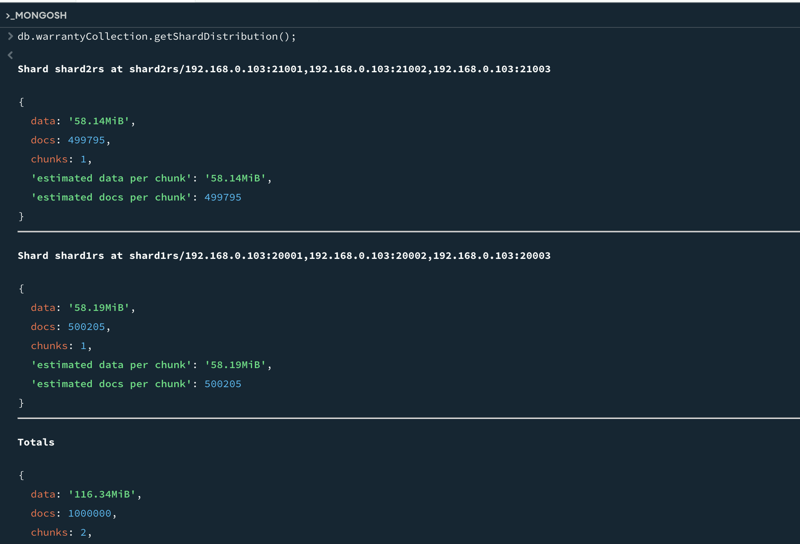

Doc: https://phoenixnap.com/kb/mongodb-sharding
https://www.bmc.com/blogs/mongodb-sharding-explained/

https://www.digitalocean.com/community/tutorials/how-to-use-sharding-in-mongodb

https://www.mongodb.com/community/forums/t/data-distribution-is-not-even-under-mongodb-sharding-setup/213560/3

rs.initiate(
  {
    _id: "cfgrs",
    configsvr: true,
    members: [
      { _id : 0, host : "192.168.0.103:10001" },
      { _id : 1, host : "192.168.0.103:10002" },
      { _id : 2, host : "192.168.0.103:10003" },
    ]
  }
)

rs.initiate(
  {
    _id: "shard1rs",
    members: [
      { _id : 0, host : "192.168.0.103:20001" },
      { _id : 1, host : "192.168.0.103:20002" },
      { _id : 2, host : "192.168.0.103:20003" }
    ]
  }
)

rs.initiate(
  {
    _id: "shard2rs",
    members: [
      { _id : 0, host : "192.168.0.103:21001" },
      { _id : 1, host : "192.168.0.103:21002" },
      { _id : 2, host : "192.168.0.103:21003" }
    ]
  }
)

sh.addShard("shard1rs/192.168.0.103:20001,192.168.0.103:20002,192.168.0.103:20003")
sh.addShard("shard2rs/192.168.0.103:21001,192.168.0.103:21002,192.168.0.103:21003")

sh.enableSharding("testDB")
sh.shardCollection("testDB.warranty", { orderNumber: 1 } )

db.getSiblingDB("config").chunks.find({ ns: "testDB.warranty" })

sh.shardCollection("testDB.warrantyCollection", { 
  orderNumber: 1, 
  warrantyStartDate: 1 
})

db.warranty.getShardDistribution();

